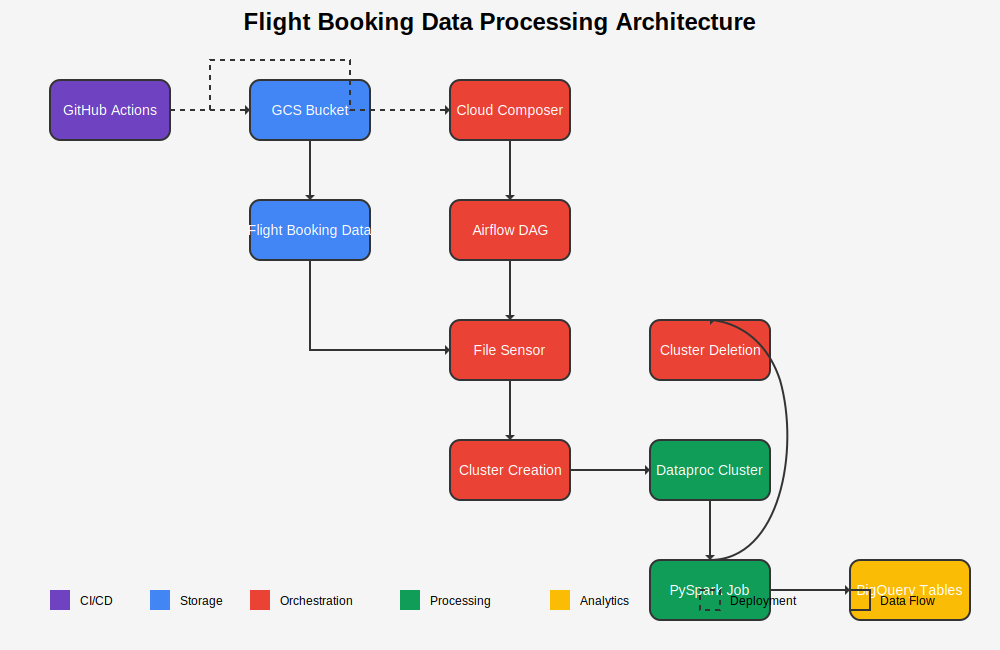

# Airline_Data_CI_CD_Project
Airline data processing on GCP using Github actions, Airflow , Spark and BigQuery

# Workflow Explanation

1. **CI/CD Process**:
   - GitHub Actions triggers when code is pushed to dev or main branch
   - Deploys code artifacts to GCS bucket
   - Updates Airflow variables in Cloud Composer
(.Images/Upload-to-dev.png)
(.Images/upload-to-prod.png)
2. **Data Ingestion**:
   - Flight booking data is stored in GCS
   - Organized in environment-specific folders (dev/prod)
(.Images/BUCKET1.png)
3. **Orchestration & Monitoring**:
   - Cloud Composer (Airflow) manages the workflow
   - The Airflow DAG includes a file sensor that monitors for new data files
(.Images/Airflow.png)
(.Images/DAGs.png)
4. **Cluster Management**:
   - When a new file is detected, Airflow first triggers the Cluster Creation task
   - This task provisions a new Dataproc cluster with the appropriate specifications
   - The cluster is created with the necessary configurations for running the PySpark job
(.Images/DAG_EXEC.png)
5. **Processing**:
   - Once the cluster is available, Airflow submits the PySpark job
   - The job processes the flight booking data:
     - Applies transformations (weekend flag, lead time categories, etc.)
     - Generates route-based insights
     - Analyzes bookings by origin
(.Images/BUCKET2.png)
6. **Data Loading**:
   - The PySpark job writes processed data directly to BigQuery tables:
     - Main transformed data table
     - Route insights table
     - Origin insights table
(.Images/BQ1.png)
(.Images/BQ2.png)
7. **Cleanup**:
   - After the PySpark job completes, Airflow triggers the cluster deletion task
   - This ensures cost optimization by removing the cluster when it's no longer needed.
